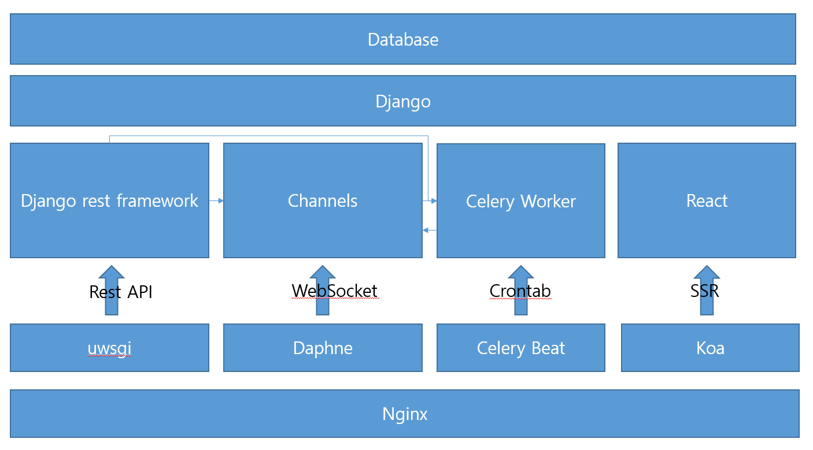

# Development

export UML.mdj to django models in Star UML
(https://github.com/CreadDiscans/staruml-django)

- cd react && npm install && cd ..
- pip install -r requirements.txt
- python manage.py copymodels
- python manage.py makemigrations
- python manage.py migrate
- python manage.py start

# Production

Django SECRET_KEY
- python manage.py makesecretkey
- update config/base.py (SECRET_KEY)

fix ssl domain
- config/service/nginx.conf
- config/service/supervisor.conf
- config/production/settings.py

docker-compose down && docker-compose up -d --build

# React

I'mport
- update react/src/mypage/Payment.tsx IMP.init(가맹점 식별코드)

Server SMTP Acount(for Activation, Password Reset)
- update config/base.py (EMAIL_HOST, EMAIL_HOST_USER, EMAIL_HOST_PASSWORD)

Social Login
- update react/src/auth/SocialLogin.tsx fbConfig for firebase(Google, Facebook)
- update react/src/auth/SocialLogin.tsx naverConfig for Naver
- update react/src/auth/SocialLogin.tsx kakaoConfig from Kakao

# React Native

Server
- change config/base.py FCM_SERVER_KEY

Android
- change android/app/google-services.json
- update android/app/src/main/res/values/string.xml RNB_GOOGLE_PLAY_LICENSE_KEY string

# License

The project is commercial license. 
If you want to be supported, please contact CreadDiscans@gmail.com.

